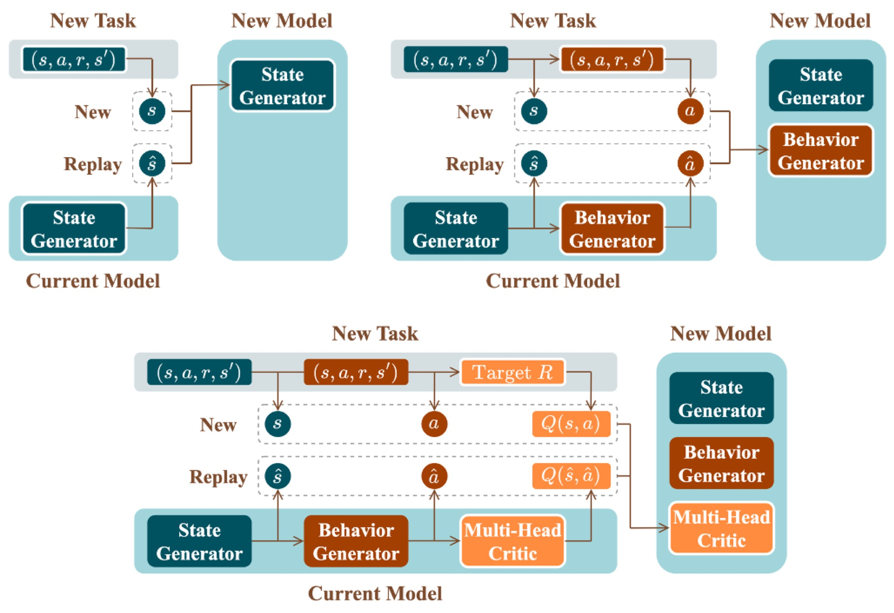

# Continual Offline Reinforcement Learning via  Diffusion-based Dual Generative Replay

## **Overview**



### **Installation instructions**

```python
conda env create -f environment.yaml
```

## Download dataset

CuGRO tested on two classical benchmarks: **MuJoCo** and **Meta-World**. The collected dataset can be downloaded [here]( https://drive.google.com/drive/folders/1i9wOBM9zRirWbJ4tIKBqXsIH6fqsWac5?usp=drive_link)

## Running

Running experiments based on our code can be quite easy. You can run all benchmarks by executing the shell file:

```python
sh run.sh
```

Or you can execute the following command to run CuGRO, take *"cheetah_vel"* as an example :

1. Train the state generator and the behavior generator.

   ```python
   CUDA_VISIBLE_DEVICES=0,1,2,3 python -m torch.distributed.launch --nproc_per_node=4  main-gene.py --env "cheetah_vel" --data_mode "gene" --actor_type "large" --diffusion_steps 100
   ```

2. Train the critic model and plot the results in the logs of all sequential tasks:

   ```python
   python critic.py --env "cheetah_vel" --data_mode "gene" --actor_type "large" --diffusion_steps 100 --gpu 0

   ```


